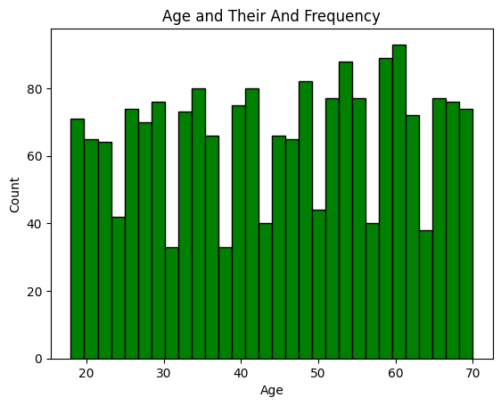
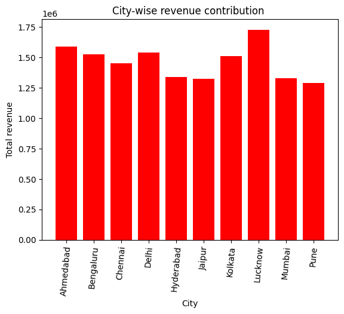
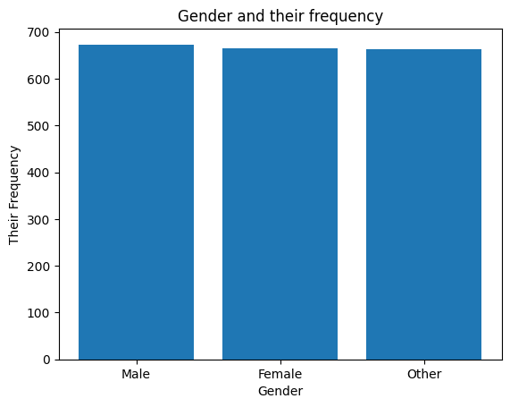
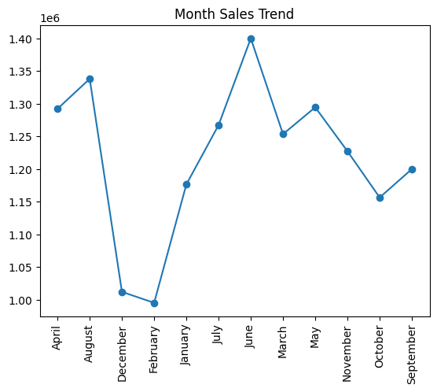
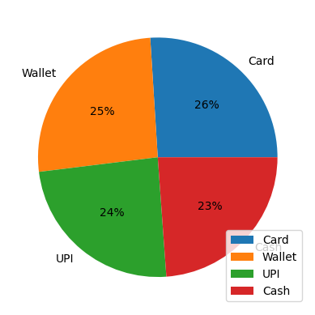
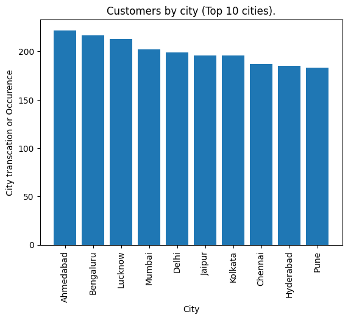
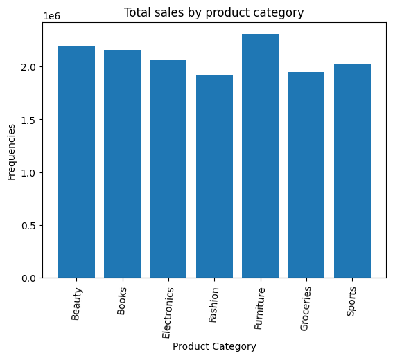
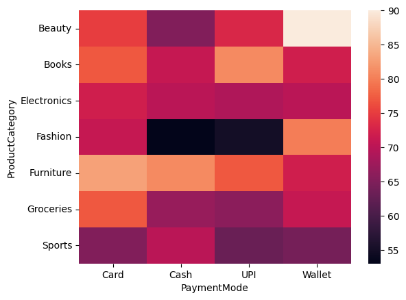

🛒 Retail Dataset – Data Cleaning, Preprocessing & EDA
📌 Project Overview
This project focuses on data inspection, cleaning, preprocessing, and exploratory data analysis (EDA) of a retail dataset.
The dataset contains 2000 customer transactions with 11 columns.

Retail Transactions Data Analysis
Dataset

File: Retail_Transactions_2000.csv
Each row represents a retail transaction with the following columns:

TransactionID – Unique ID for each transaction

CustomerID – Unique ID for customers

Gender – Male/Female/Other

Age – Age of the customer

City – City where purchase happened

ProductCategory – Category of product purchased (Electronics, Fashion, Groceries, Furniture, etc.)

Quantity – Units purchased

Price – Price per unit (₹)

TotalAmount – Derived column (Quantity × Price)

PurchaseDate – Date of purchase

PaymentMode – Cash, Card, UPI, Wallet
⚙️ Data processing Steps
1. Data Inspection
Checked dataset size, structure, column details.
Identified missing values, duplicates, and inconsistencies.
2. Feature Engineering
Derived TotalAmount column (Quantity × Price).
Extracted Month and DayOfWeek from PurchaseDate.
Created AgeGroup bins (18–25, 26–40, 41–60, 60+).
3. Data Visualization
        1. Customer Demographics
            - Age distribution of customers.
            - Gender distribution.
            - Customers by city (Top 10 cities).

        2. Sales Insights
            - Total sales by product category.
            - Monthly sales trend (line chart).
            - Payment mode usage (pie chart)

        3. Advanced Insights
             - Average spend per customer by age group.
             - City-wise revenue contribution (bar chart).
            - Heatmap of product category vs payment mode.
DATA VISUALIZATION:
        
        
        
        
        
        
        git 
        
    
    🎯 Expected Learning Outcomes:

                Understand real-world challenges in raw retail data
                Learn step-by-step preprocessing (cleaning, missing values, encoding, feature engineering)
                Develop data visualization skills for business storytelling
                Build confidence in creating business-ready datasets